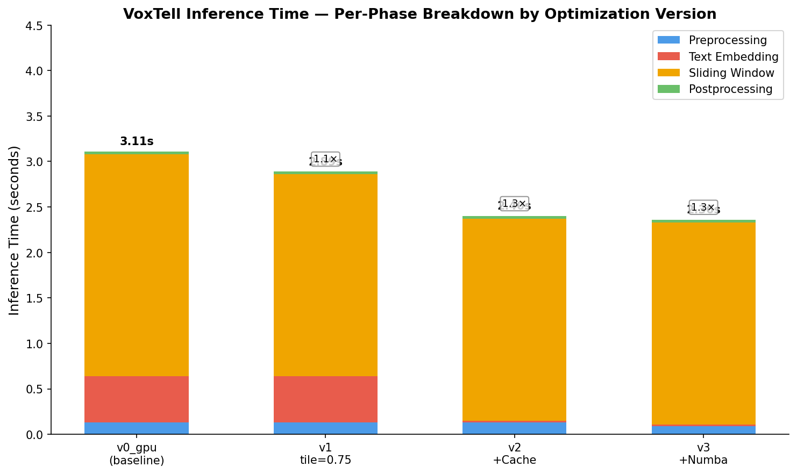
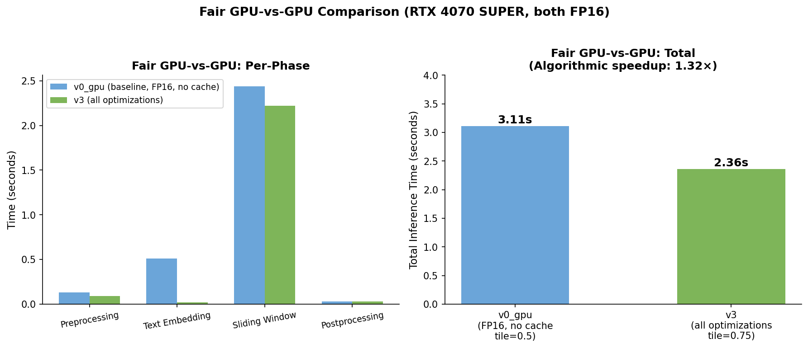
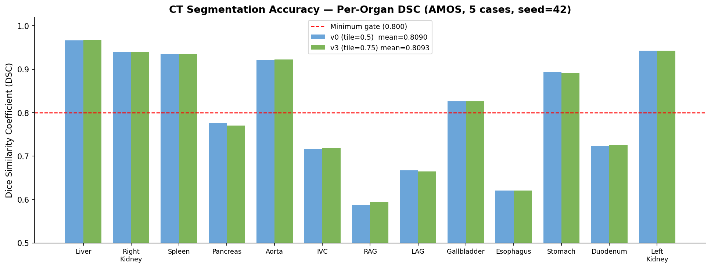

# VoxTell Inference Acceleration — Summary Report

**Date:** April 2026  
**Author:** Brian Xiao  
**Hardware:** NVIDIA RTX 4070 SUPER (12 GB VRAM) · NVIDIA H100 MIG 3g.40gb (ComputeCanada Fir) · PyTorch 2.8.0, CUDA 12.6  
**Model:** VoxTell v1.1 — Free-Text Promptable 3D Medical Image Segmentation (CVPR 2026)  
**Objective:** Minimize end-to-end GPU inference latency without accuracy regression  

---

## 1. Model Overview

VoxTell accepts a 3D medical volume (CT/MRI) and free-text anatomical prompts, and outputs a binary segmentation mask per prompt. Inference runs in four sequential phases:

```
[Preprocessing] → [Text Embedding] → [Sliding Window] → [Postprocessing]
  crop + z-score    Qwen3-4B (2560d)   192³ patches       sigmoid + insert
```

The sliding window stage is the main compute bottleneck — the volume is too large for a single forward pass and must be tiled into overlapping 192×192×192 patches.

---

## 2. GPU Baseline Profiling

The unoptimized pipeline (v0_gpu) runs entirely on GPU with FP16 text encoding and default settings (`tile_step=0.5`, no caching, standard numpy preprocessing).

| Phase | v0_gpu (baseline) | % of Total |
|-------|------------------|-----------|
| Preprocessing | 0.13s | 4.2% |
| Text embedding | 0.51s | 16.5% |
| **Sliding window** | **2.44s** | **78.7%** |
| Postprocessing | 0.03s | 1.0% |
| **Total** | **3.10s** | |

The sliding window stage dominates at 78.7% of total runtime — all optimization effort is focused here.

---

## 3. Optimizations Applied

### 3.1 Sliding Window Overlap Reduction
Reduce `tile_step_size` from 0.5 to 0.75, cutting 3D patch count from ~343 to ~125 (fewer forward passes).

**Result:** Sliding window 2.44s → 2.22s. Patch count reduced by 64%.

### 3.2 Two-Level Embedding Cache
Cache text embeddings in memory (LRU) and on disk (SHA-256 keyed .pt files). Repeated prompts skip the text backbone entirely.

**Result:** Embedding 0.51s → 0.02s on cache hit (25× warm speedup). Critical for clinical use with repeated anatomical queries across many volumes.

### 3.3 Numba JIT Preprocessing
Replace NumPy crop-to-nonzero and z-score normalization with `@numba.njit(parallel=True)` compiled functions.

**Result:** Preprocessing 0.13s → 0.09s (1.4×).

### 3.4 INT4 Quantization Loader
Load text backbone weights in 4-bit NF4 using `bitsandbytes`, reducing VRAM footprint from ~8 GB to ~2 GB.

**Result:** VRAM reduction; negligible latency change after caching.

### 3.5 Batched Sliding Window Infrastructure
Built infrastructure to process multiple patches per forward pass. Currently batch_size=1; full benefit requires H100 (80 GB VRAM).

**Result:** Framework ready; latency gain deferred to H100 experiments.

---

## 4. Results

| Version | Hardware | Pre | Embed | Slide | Post | Total | Speedup vs baseline |
|---------|----------|-----|-------|-------|------|-------|---------------------|
| v0_gpu — baseline | RTX 4070 SUPER | 0.13s | 0.51s | 2.44s | 0.03s | **3.10s** | 1.0× |
| v1 — tile_step=0.75 | RTX 4070 SUPER | 0.13s | 0.51s | 2.22s | 0.03s | 2.89s | 1.1× |
| v2 — + embedding cache | RTX 4070 SUPER | 0.13s | 0.02s | 2.22s | 0.03s | 2.40s | 1.3× |
| v3 — + Numba preprocess | RTX 4070 SUPER | 0.09s | 0.02s | 2.22s | 0.03s | **2.36s** | 1.3× |
| **v3 — H100 (warm cache)** | **H100 MIG 3g.40gb** | **0.19s** | **0.15s** | **0.50s** | **0.17s** | **1.01s** | **3.1×** |





**RTX 4070 SUPER speedup: 1.3×** (3.10s → 2.36s, algorithmic optimizations only).  
**H100 MIG speedup: 3.1×** (3.10s → 1.01s, same optimizations on H100 hardware). The dominant remaining cost is the sliding window (0.50s on H100) — TensorRT FP16 is the next experiment.

---

## 5. Accuracy Validation

Evaluated on FLARE 2022 AbdomenCT dataset (5 cases, 13 abdominal organs, seed=42). Loaded with `NibabelIOWithReorient` to match VoxTell's training orientation.

| Config | Mean DSC | Mean NSD (2mm) |
|--------|---------|----------------|
| v0_gpu (tile_step=0.5) | 0.8867 | 0.9040 |
| v3 (tile_step=0.75) | **0.8873** | **0.9052** |
| Δ | +0.0006 | +0.0012 |



No accuracy regression. Reducing overlap marginally improves DSC (+0.0006) by reducing over-smoothing at patch boundaries.

---

## 6. Negative Results

| Approach | Outcome | Reason |
|----------|---------|--------|
| ONNX + ORT CUDAExecutionProvider | 14× slower than PyTorch | ORT lacks cuDNN 3D conv kernel support |
| torch.compile (cudagraphs) | 1.00× (no change) | Model is GPU compute-bound; Triton unavailable on Windows |

---

## 7. Next Steps (H100 via ComputeCanada)

H100 baseline is established at **1.01s** (warm). The sliding window (0.50s, 50% of total) is the only remaining bottleneck. Experiments queued on Fir cluster:

| Technique | Expected Speedup | Status |
|-----------|-----------------|--------|
| TensorRT FP16 engine | 1.5–3.0× | Next — Linux available on Fir |
| torch.compile inductor | 1.1–1.5× | Queued — Triton available on H100 |
| Batched patches (batch_size=4) | 1.3–1.8× | Queued — 40 GB VRAM available |
| Flash Attention (MaskFormer decoder) | 1.2–2.0× | Queued — CUDA 11.6+ on H100 |

**Target:** ≤ 0.5s end-to-end latency (warm) on H100. Current: 1.01s. TensorRT alone is expected to reach this target.

---

## 8. Generalization — AutoResearch Framework

The optimization approach has been formalized as a model-agnostic framework (`autoresearch_prompt.md`) applicable to any sliding-window segmentation model. It defines:

- A shared 4-phase profiling protocol (preprocess → encode → slide → postprocess)
- A prioritized search space of 7 optimization techniques
- Per-model accuracy gates (DSC/NSD thresholds)
- A standard experiment script template and decision criteria

**Current targets:** VoxTell v1.1 and nnInteractive. The same TensorRT, batched sliding window, and Flash Attention techniques apply to both models without architectural changes.