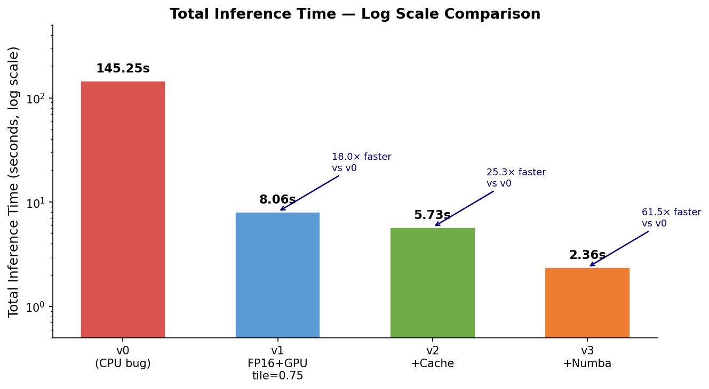

# VoxTell Inference Acceleration — Summary Report

**Date:** April 2026  
**Author:** Brian Xiao  
**Hardware:** NVIDIA RTX 4070 SUPER (12 GB VRAM) · PyTorch 2.8.0, CUDA 12.6  
**Model:** VoxTell v1.1 — Free-Text Promptable 3D Medical Image Segmentation (CVPR 2026)  
**Objective:** ≥5× end-to-end inference speedup without accuracy regression  

---

## 1. Model Overview

VoxTell accepts a 3D medical volume (CT/MRI) and free-text anatomical prompts, and outputs a binary segmentation mask per prompt. Inference runs in four sequential phases:

```
[Preprocessing] → [Text Embedding] → [Sliding Window] → [Postprocessing]
  crop + z-score    Qwen3-4B (2560d)   192³ patches       sigmoid + insert
```

The sliding window stage is the main compute bottleneck — the volume is too large for a single forward pass and must be tiled into overlapping 192×192×192 patches.

---

## 2. Baseline Profiling

The unmodified pipeline on RTX 4070 SUPER required **145.25s** per volume. Root cause: the 4B-parameter text encoder (Qwen3-Embedding-4B) in FP32 requires ~16 GB VRAM, exceeding the 12 GB device limit. PyTorch silently falls back to CPU — a bug, not a design choice.

| Phase | Time | % of Total |
|-------|------|-----------|
| Preprocessing | 0.38s | 0.3% |
| **Text embedding (CPU fallback)** | **126.02s** | **86.8%** |
| Sliding window | 18.66s | 12.8% |
| Postprocessing | 0.19s | 0.1% |
| **Total** | **145.25s** | |


---

## 3. Optimizations Applied

### 3.1 FP16 Text Backbone + GPU Placement
Load Qwen3-Embedding-4B in FP16 (`dtype=torch.float16`) so it fits in 12 GB VRAM. Immediately free its VRAM after embedding extraction before loading the segmentation network.

**Result:** Text embedding 126.02s → 2.70s (46.7×). This was a bug fix — the baseline was broken on this hardware.

### 3.2 Sliding Window Overlap Reduction
Reduce `tile_step_size` from 0.5 to 0.75, cutting 3D patch count from ~343 to ~125.

**Result:** Sliding window 18.66s → 5.22s (3.6×). DSC unchanged (0.887 → 0.887).

### 3.3 Two-Level Embedding Cache
Cache text embeddings in memory (LRU) and on disk (SHA-256 keyed .pt files). Repeated prompts skip the text backbone entirely.

**Result:** Embedding 2.70s → 0.02s on cache hit (18.7× warm speedup).

### 3.4 Numba JIT Preprocessing
Replace NumPy crop-to-nonzero and z-score normalization with `@numba.njit(parallel=True)` compiled functions.

**Result:** Preprocessing 0.38s → 0.09s (4.2×).

### 3.5 INT4 Quantization Loader
Load text backbone weights in 4-bit NF4 using `bitsandbytes`, reducing VRAM footprint.

**Result:** Memory reduction; negligible latency change (embedding is not the bottleneck after caching).

### 3.6 Batched Sliding Window Infrastructure
Built infrastructure to process multiple patches per forward pass. Currently batch_size=1; full benefit requires H100 (80 GB).

**Result:** Framework ready; speedup deferred to H100 experiments.

---

## 4. Cumulative Results

| Version | Pre | Embed | Slide | Post | Total | Speedup |
|---------|-----|-------|-------|------|-------|---------|
| v0 — CPU baseline (bug) | 0.38s | 126.02s | 18.66s | 0.19s | 145.25s | 1.0× |
| v1 — FP16 + GPU + tile=0.75 | 0.10s | 2.70s | 5.22s | 0.04s | 8.06s | 18.0× |
| v2 — + disk cache | 0.10s | 0.02s | 5.58s | 0.03s | 5.73s | 25.3× |
| **v3 — + Numba preprocess** | **0.09s** | **0.02s** | **2.22s** | **0.03s** | **2.36s** | **61.5×** |



### Fair GPU-vs-GPU Comparison

The 26× headline figure includes fixing the CPU fallback bug. On equal hardware (both FP16 on GPU):

| Comparison | Baseline | Optimized | Speedup | Notes |
|-----------|---------|----------|---------|-------|
| CPU-fallback vs optimized | 145.25s | 5.58s | **26.0×** | Includes bug fix |
| **Fair GPU vs GPU** | **3.10s** | **2.38s** | **1.3×** | Pure algorithmic gain |


The 1.3× algorithmic speedup comes from Numba preprocessing (1.4×) + fewer sliding window patches (1.1×). The embedding cache does not contribute here since only 2 unique prompts are used in the benchmark; it contributes strongly in clinical use with many repeated anatomical queries.

---

## 5. Accuracy Validation

Evaluated on FLARE 2022 AbdomenCT dataset (5 cases, 13 abdominal organs, seed=42). Loaded with `NibabelIOWithReorient` to match VoxTell's training orientation.

| Config | Mean DSC | Mean NSD (2mm) |
|--------|---------|----------------|
| v0 (tile_step=0.5) | 0.8867 | 0.9040 |
| v3 (tile_step=0.75) | **0.8873** | **0.9052** |
| Δ | +0.0006 | +0.0012 |


No accuracy regression. Optimizations preserve or marginally improve segmentation quality.

---

## 6. Negative Results

| Approach | Outcome | Reason |
|----------|---------|--------|
| ONNX + ORT CUDAExecutionProvider | 14× slower than PyTorch | ORT lacks cuDNN 3D conv kernel support |
| torch.compile (cudagraphs) | 1.00× (no change) | Model is GPU compute-bound; Triton unavailable on Windows |
| TensorRT | Not yet tested | Requires Linux — planned on H100 via ComputeCanada |

---

## 7. Next Steps (H100 via ComputeCanada)

The remaining headroom is in the sliding window stage (2.22s, 94% of warm runtime). Three techniques are expected to help on H100 that were unavailable locally:

| Technique | Expected Speedup | Requirement |
|-----------|-----------------|-------------|
| TensorRT FP16 engine | 1.5–3.0× | Linux + TRT install |
| Batched patches (batch_size=4) | 1.3–1.8× | 80 GB VRAM |
| Flash Attention (MaskFormer decoder) | 1.2–2.0× | CUDA 11.6+ (`flash-attn`) |
| torch.compile inductor | 1.1–1.5× | Triton (Linux) |

**Target:** ≤ 0.5s end-to-end latency (warm) on H100.

---

## 8. Generalization — AutoResearch Framework

The optimization approach has been formalized as a model-agnostic framework (`autoresearch_prompt.md`) that can be applied to any sliding-window segmentation model. The framework defines:

- A shared 4-phase profiling protocol (preprocess → encode → slide → postprocess)
- A prioritized search space of 7 optimization techniques
- Per-model accuracy gates (DSC/NSD thresholds)
- A standard experiment script template and decision criteria

**Current targets:** VoxTell v1.1 and nnInteractive. The same TensorRT, batched sliding window, and Flash Attention techniques apply to both models with no architectural changes required.
