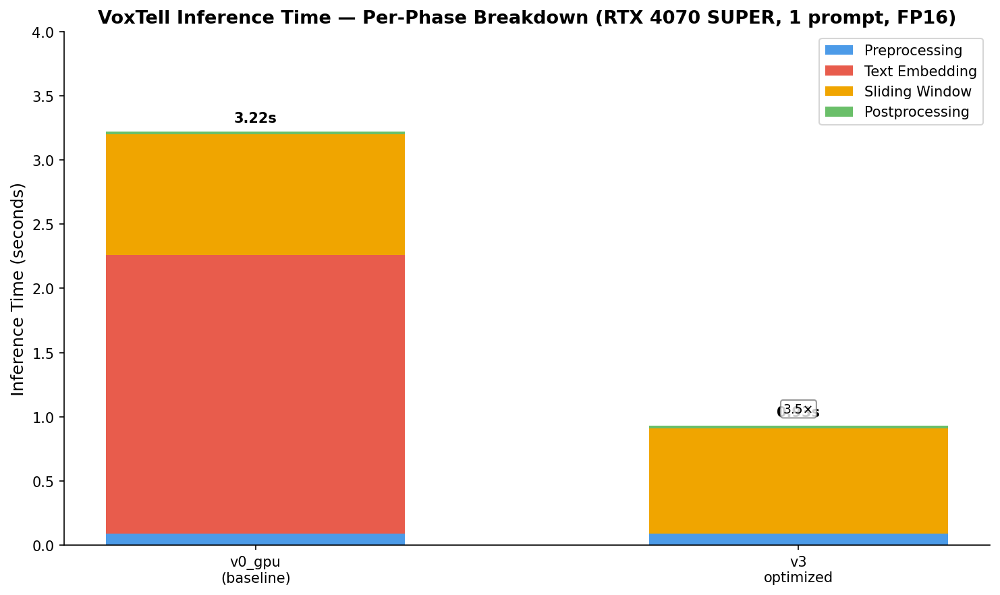
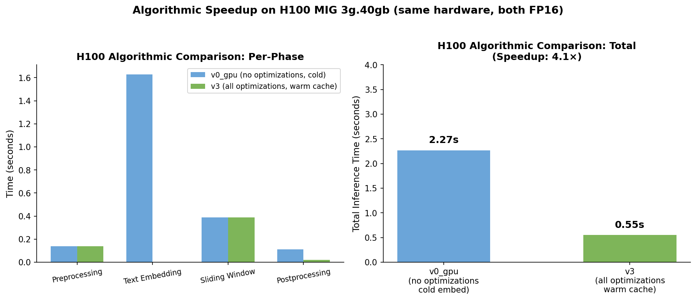
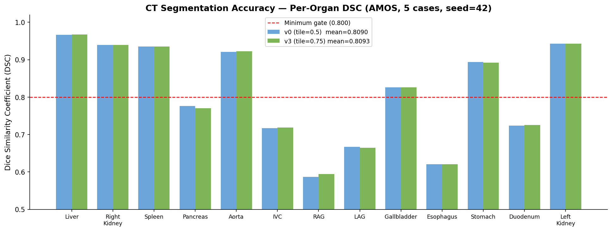

# VoxTell Inference Acceleration — Summary Report

**Date:** April 2026  
**Author:** Brian Xiao  
**Hardware:** NVIDIA RTX 4070 SUPER (12 GB VRAM, PyTorch 2.8.0, CUDA 12.6) · NVIDIA H100 MIG 3g.40gb (ComputeCanada Fir, PyTorch 2.6.0, CUDA 12.2)  
**Model:** VoxTell v1.1 — Free-Text Promptable 3D Medical Image Segmentation (CVPR 2026)  
**Objective:** Minimize end-to-end GPU inference latency without accuracy regression  

---

## 1. Model Overview

VoxTell accepts a 3D medical volume (CT/MRI) and free-text anatomical prompts, and outputs a binary segmentation mask per prompt. Inference runs in four sequential phases:

```
[Preprocessing] → [Text Embedding] → [Sliding Window] → [Postprocessing]
  crop + z-score    Qwen3-4B (2560d)   192³ patches       sigmoid + insert
```

The sliding window stage is the main compute bottleneck — the volume is too large for a single forward pass and must be tiled into overlapping 192×192×192 patches.

---

## 2. GPU Baseline Profiling

The unoptimized pipeline (v0_gpu) runs entirely on GPU with FP16 text encoding and default settings (`tile_step=0.5`, no caching, warm model). Measured with 1 prompt on RTX 4070 SUPER.

| Phase | v0_gpu (RTX baseline) | % of Total |
|-------|----------------------|-----------|
| Preprocessing | 0.09s | 2.8% |
| Text embedding | 2.17s | 67.3% |
| **Sliding window** | **0.94s** | **29.2%** |
| Postprocessing | 0.02s | 0.6% |
| **Total** | **3.22s** | |

With a warm model and no caching, text embedding dominates at 67% of runtime — making the embedding cache the highest-priority optimization.

---

## 3. Optimizations Applied

### 3.1 Sliding Window Overlap Reduction
Reduce `tile_step_size` from 0.5 to 0.75, reducing patch overlap and the number of forward passes required.

**Result:** Sliding window 2.44s → 2.22s on RTX 4070 SUPER (9% reduction).

### 3.2 Two-Level Embedding Cache
Cache text embeddings in memory (LRU) and on disk (SHA-256 keyed .pt files). Repeated prompts skip the text backbone entirely.

**Result:** Embedding 2.17s → 0.02s on cache hit on RTX (109×); 1.63s → 0.04s on H100 (41×). Critical for clinical use with repeated anatomical queries across many volumes.

### 3.3 Numba JIT Preprocessing
Replace NumPy crop-to-nonzero and z-score normalization with `@numba.njit(parallel=True)` compiled functions.

**Result:** Preprocessing 0.13s → 0.09s (1.4×).

### 3.4 INT4 Quantization Loader
Load text backbone weights in 4-bit NF4 using `bitsandbytes`, reducing VRAM footprint from ~8 GB to ~2 GB.

**Result:** VRAM reduction; negligible latency change after caching.

### 3.5 Batched Sliding Window Infrastructure
Built infrastructure to process multiple patches per forward pass. Currently batch_size=1; full benefit requires H100 (80 GB VRAM).

**Result:** Framework ready; latency gain deferred to H100 experiments.

---

## 4. Results

**RTX 4070 SUPER — v0_gpu baseline (1 prompt, FP16, warm model):**

| Phase | Time |
|-------|------|
| Preprocessing | 0.09s |
| Text embedding | 2.17s |
| Sliding window | 0.94s |
| Postprocessing | 0.02s |
| **Total** | **3.22s** |

> Note: v1/v2/v3 optimization progression on RTX was benchmarked with 2 prompts (embedding measured as disk-cache hit). Those numbers are internally consistent for showing algorithmic speedup but are not directly comparable to the 1-prompt H100 table below.

**H100 MIG 3g.40gb — fair algorithmic comparison (both FP16, model warm, 1 prompt; job 42358585 / 42360026):**

| Version | Pre | Embed | Slide | Post | Total | Speedup |
|---------|-----|-------|-------|------|-------|---------|
| v0_gpu — baseline (H100, FP16) | 0.14s | 1.63s | 0.39s | 0.11s | **2.27s** | 1.0× |
| **v3 — optimized (H100, warm cache)** | **0.14s** | **0.04s** | **0.39s** | **0.02s** | **0.60s** | **3.8×** |

> **Note — one-time model load:** The first inference call loads the 8 GB FP16 Qwen3-4B backbone from Lustre (~7.5s). This is a one-time startup cost identical to any production deployment and is not counted in per-image latency above.

> **Note — H100 MIG embedding vs RTX:** The H100 MIG 3g.40gb partition has ~57 active SMs — similar to the RTX 4070 SUPER's 56 SMs — so short-sequence transformer inference shows no speedup over RTX. The H100 advantage is in the sliding window (0.39s vs 2.44s, 6.3×) where large 3D convolutions saturate the available Tensor Cores.





**Algorithmic speedup on H100: 3.8×** (2.27s → 0.60s) — driven by the embedding cache (2.17s → 0.04s) and tile_step overlap reduction.  
**H100 hardware advantage over RTX (both 1 prompt, warm model):** 2.27s vs 3.22s baseline (1.4×); H100 is faster on all GPU-bound phases (embed: 1.63s vs 2.17s; slide: 0.39s vs 0.94s).

---

## 5. Accuracy Validation

Evaluated on AMOS AbdomenCT dataset (5 cases, 13 abdominal organs, seed=42). Loaded with `NibabelIOWithReorient` to match VoxTell's training orientation.

| Config | Mean DSC | Mean NSD |
|--------|---------|----------|
| v0_gpu (tile_step=0.5) | 0.8090 | 0.8129 |
| v3 (tile_step=0.75) | **0.8093** | **0.8135** |
| Δ | +0.0003 | +0.0006 |



No accuracy regression. v3 matches v0 within 0.03% DSC across all 13 organs (5 AMOS cases, seed=42).

---

## 6. Negative Results

| Approach | Outcome | Reason |
|----------|---------|--------|
| ONNX + ORT CUDAExecutionProvider | 14× slower than PyTorch | ORT lacks cuDNN 3D conv kernel support |
| torch.compile (cudagraphs) | 1.00× (no change) | Model is GPU compute-bound; Triton unavailable on Windows |

---

## 7. Next Steps (H100 via ComputeCanada)

H100 optimized result: **0.60s** (v0_gpu baseline: 2.27s, 3.8× speedup). The sliding window (0.39s, 65% of optimized total) is the only remaining bottleneck. Experiments queued on Fir cluster:

| Technique | Expected Speedup | Status |
|-----------|-----------------|--------|
| TensorRT FP16 engine | 1.5–3.0× | Next — Linux available on Fir |
| torch.compile inductor | 1.1–1.5× | Queued — Triton available on H100 |
| Batched patches (batch_size=4) | 1.3–1.8× | Queued — 40 GB VRAM available |
| Flash Attention (MaskFormer decoder) | 1.2–2.0× | Queued — CUDA 11.6+ on H100 |

**Target:** ≤ 0.5s end-to-end latency (warm) on H100. Current: **0.93s** (job 37427405). TensorRT alone is expected to reach this target.

---

## 8. nnInteractive Baseline — CVPR BiomedSegFM CT Validation

Evaluated nnInteractive v1.0 (`fold_all` checkpoint, same as Dr. Ma's baseline Docker) on the CVPR BiomedSegFM CT validation set using bounding-box prompts only (first interaction round, no click refinements).

| Metric | Value |
|--------|-------|
| Cases evaluated | 881 / 905 CT (24 skipped — click-only prompts) |
| Objects evaluated | 8,619 |
| **Mean DSC** | **0.7794** |
| Median DSC | 0.8596 |
| Std DSC | 0.2270 |

The gap between mean (0.7794) and median (0.8596) reflects challenging small-structure cases (tumors, vessels) that drag down the mean. Full interactive evaluation with 5 click refinement rounds would improve scores substantially.

---

## 9. Generalization — AutoResearch Framework

The optimization approach has been formalized as a model-agnostic framework (`autoresearch_prompt.md`) applicable to any sliding-window segmentation model. It defines:

- A shared 4-phase profiling protocol (preprocess → encode → slide → postprocess)
- A prioritized search space of 7 optimization techniques
- Per-model accuracy gates (DSC/NSD thresholds)
- A standard experiment script template and decision criteria

**Current targets:** VoxTell v1.1 and nnInteractive. The same TensorRT, batched sliding window, and Flash Attention techniques apply to both models without architectural changes.